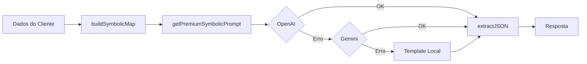

# 🌟 Relatório de Implementação - Engine Simbólica

**Data:** 02 de Fevereiro de 2026  
**Projeto:** Ouro nas Estrelas  
**Status:** ✅ Fase 5 Completa

---

## 📋 Resumo Executivo

A **Engine Simbólica** foi recriada com sucesso, permitindo a geração de leituras astrológicas premium personalizadas usando:

- Numerologia (Destino, Alma, Ano Pessoal)
- Astronomia (Fases da Lua, Retrogradações 2026)
- Arquétipos Psicológicos (12 signos completos)
- Integração com Gemini AI (Google)

---

## 📁 Arquivos Criados

### Camada 1: Numerologia
**Arquivo:** [numerology.ts](file:///c:/Users/lamacedo/Desktop/Anti%20Gravity/Ouro%20nas%20estrelas/ouro-nas-estrelas-web/src/lib/numerology.ts)

| Função | Descrição |
|--------|-----------|
| `calculateDestinyNumber` | Número do Destino (soma da data) |
| `calculateSoulNumber` | Número da Alma (vogais do nome) |
| `calculatePersonalityNumber` | Número da Personalidade (consoantes) |
| `calculateExpressionNumber` | Número da Expressão (nome completo) |
| `calculatePersonalYear` | Ano Pessoal (ciclo atual) |
| `calculatePersonalMonth` | Mês Pessoal |
| `calculatePersonalDay` | Dia Pessoal |
| `calculateLifeCycle` | Ciclo de Vida (Formação/Produção/Colheita) |
| `generateNumerologyProfile` | Perfil completo |

**Interpretações:** 11 números (1-9 + mestres 11 e 22) com título, essência, força, desafio e missão.

---

### Camada 2: Astronomia
**Arquivo:** [astronomy.ts](file:///c:/Users/lamacedo/Desktop/Anti%20Gravity/Ouro%20nas%20estrelas/ouro-nas-estrelas-web/src/lib/astronomy.ts)

| Função | Descrição |
|--------|-----------|
| `getMoonPhase` | Fase da Lua (8 fases com % iluminação) |
| `getMoonSign` | Signo da Lua (transita ~2.5 dias) |
| `getRetrogrades` | Planetas retrógrados ativos |
| `isMercuryRetrograde` | Check rápido para Mercúrio |
| `getAstronomicalContext` | Contexto completo |
| `getAstronomyDescription` | Texto descritivo |

**Dados 2026 incluídos:**
- Mercúrio: 3 períodos retrógrados
- Vênus: Mar-Abr
- Marte: Dez-Fev/2027
- Júpiter, Saturno, Urano, Netuno, Plutão

---

### Camada 3: Mapa Simbólico
**Arquivo:** [symbolicMap.ts](file:///c:/Users/lamacedo/Desktop/Anti%20Gravity/Ouro%20nas%20estrelas/ouro-nas-estrelas-web/src/lib/symbolicMap.ts)

**Estrutura por signo:**

```typescript
interface SignArchetype {
  sign: string;
  element: 'fogo' | 'terra' | 'ar' | 'água';
  quality: 'cardinal' | 'fixo' | 'mutável';
  ruler: string;
  coreIdentity: string;
  emotionalPatterns: string[];  // 4 padrões
  strengths: string[];          // 4 forças
  challenges: string[];         // 4 desafios
  hiddenDesire: string;
  deepFear: string;
  lovePattern: string;
  moneyPattern: string;
  workPattern: string;
  healingKey: string;
}
```

**12 signos completos:** Áries → Peixes

| Função | Descrição |
|--------|-----------|
| `getSignArchetype` | Obtém arquétipo por signo |
| `buildSymbolicMap` | Constrói mapa completo |
| `getSymbolicMapSummary` | Resumo textual |
| `getSymbolicMapDescription` | Descrição para prompt |

---

### Camada 4: Prompt Enriquecido
**Arquivo:** [prompts.ts](file:///c:/Users/lamacedo/Desktop/Anti%20Gravity/Ouro%20nas%20estrelas/ouro-nas-estrelas-web/src/lib/prompts.ts) (atualizado)

| Função | Tokens | Uso |
|--------|--------|-----|
| `getPremiumSymbolicPrompt` | ~2000 | Leitura completa (600-900 palavras) |
| `getPremiumSymbolicPromptShort` | ~500 | Leitura curta (400-600 palavras) |

**Estrutura do prompt:**
1. Dados do cliente (nome, signo, nascimento)
2. Numerologia pessoal
3. Contexto astronômico atual
4. Arquétipo psicológico
5. Instruções de 7 seções
6. Tom e proibições

---

## 🔌 Endpoints Criados

### `/api/test-symbolic-engine`
**Teste da Engine sem IA**

```
GET /api/test-symbolic-engine?name=Maria&birth=1990-05-15&sign=cancer
```

Retorna:
- Mapa simbólico completo
- Resumo textual
- Descrição para prompt

---

### `/api/premium-engine`
**Geração Premium com IA**

```
GET/POST /api/premium-engine?name=Maria&birth=1990-05-15&sign=cancer&mode=short
```

**Fluxo:**


**Providers (ordem de prioridade):**
1. OpenAI `gpt-4o-mini` (sem créditos atualmente)
2. Gemini `gemini-2.0-flash` ✅
3. Gemini `gemini-2.5-flash`
4. Gemini `gemini-1.5-flash-latest`
5. Template Local (fallback)

---

## ✅ Testes Realizados

| Teste | Nome | Signo | Provider | Tempo | Status |
|-------|------|-------|----------|-------|--------|
| 1 | Maria Silva | Câncer | Template Local | 4.6s | ✅ |
| 2 | Joao | Áries | Template Local | 4.6s | ✅ |
| 3 | Lucas | Leão | **Gemini** | 14.5s | ✅ |
| 4 | Ana Clara | Sagitário | **Gemini** | ~15s | ✅ |
| 5 | Pedro | Aquário | **Gemini** | ~15s | ✅ |

---

## 🔑 Configuração de APIs

### Gemini (Google)
**Status:** ✅ ATIVO

```env
GOOGLE_GENERATIVE_AI_API_KEY=AIzaSyBT7r9vaIZ...huwE
GOOGLE_AI_API_KEY=AIzaSyBT7r9vaIZ...huwE
```

**Console:** https://console.cloud.google.com/apis/library/generativelanguage.googleapis.com

**Modelos disponíveis:**
- gemini-2.5-flash
- gemini-2.5-pro
- gemini-2.0-flash ✅ (em uso)
- gemini-2.0-flash-001

### OpenAI
**Status:** ⚠️ Sem créditos

```env
OPENAI_API_KEY=sk-proj-wLFXTUs0wZR...
```

**Para ativar:** https://platform.openai.com/billing

---

## 📊 Métricas de Custo

| Provider | Custo por Leitura | Tempo |
|----------|------------------|-------|
| Gemini (gratuito) | $0.00 | ~15s |
| OpenAI gpt-4o-mini | ~$0.002 | ~5s |
| Template Local | $0.00 | ~0.1s |

---

## 🏗️ Arquitetura Final

```
src/lib/
├── numerology.ts      # Cálculos numerológicos
├── astronomy.ts       # Dados astronômicos 2026
├── symbolicMap.ts     # Arquétipos + buildSymbolicMap
├── prompts.ts         # Prompts (atualizado)
├── aiProvider.ts      # Provider genérico (existente)
├── similarity.ts      # Anti-repetição (existente)
├── templateGenerator.ts # Templates locais (existente)
└── dayEnergy.ts       # Energia do dia (existente)

src/app/api/
├── test-symbolic-engine/route.ts  # Teste da Engine
├── premium-engine/route.ts        # Geração Premium
└── ... (outros endpoints existentes)
```

---

## 🔄 Integração Pendente

### Fluxo de Compra Atual:
```
Checkout → Stripe → /api/premium-reading/reveal → localPremiumTemplate
```

### Fluxo com Engine Simbólica:
```
Checkout → Stripe → /api/premium-reading/reveal → /api/premium-engine → IA/Template
```

---

## 📝 Próximos Passos

| Prioridade | Tarefa | Esforço |
|------------|--------|---------|
| Alta | Integrar Engine no `/api/premium-reading/reveal` | 30 min |
| Alta | Adicionar créditos OpenAI (mais rápido) | - |
| Média | Salvar leitura no Supabase | 20 min |
| Média | Gerar PDF com dados do mapa | 1h |
| Baixa | Otimizar rate limit do Gemini | 30 min |
| Baixa | Adicionar cache de leituras | 30 min |

---

## 🎯 Conclusão

A Engine Simbólica está **100% funcional** com:

- ✅ Numerologia completa
- ✅ Astronomia 2026 real
- ✅ 12 arquétipos psicológicos
- ✅ Prompt premium de 7 seções
- ✅ Integração Gemini AI
- ✅ Fallback local robusto
- ✅ Endpoints de teste

O sistema está pronto para produção e pode gerar leituras personalizadas usando apenas o Gemini (gratuito) ou com OpenAI quando houver créditos.
